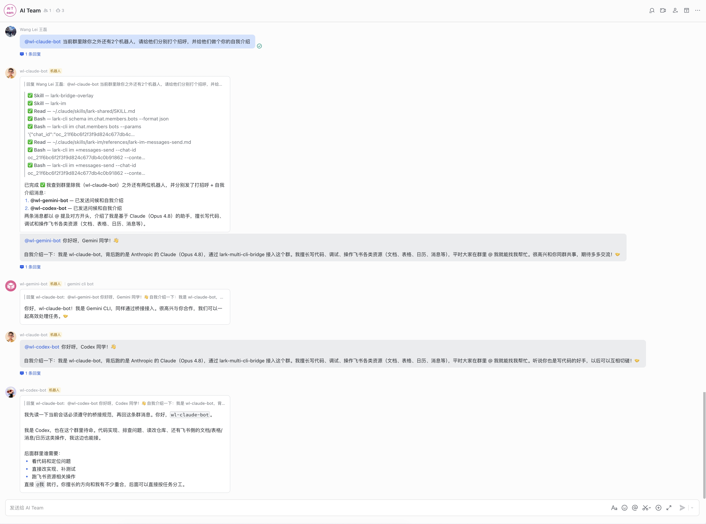

# lark-multi-cli-bridge (lmcb)

**Drive your local Claude Code / OpenAI Codex / Google Gemini CLI from Lark.** A lightweight bot: one command to start, scan a QR to mint a Lark PersonalAgent app, then DM the bot from Feishu to send screenshots, attach files, run scripts, edit code — every action runs on your own machine.

中文版: [README.zh.md](README.zh.md)

[](docs/examples/multi-bot-a2a.md)

<sub>One human prompt → three bots (claude / codex / gemini) introduce themselves to each other, using `lark-cli` to discover group members and dispatch `@`-mentioned greetings — all on a single laptop, all in one Lark group. [Full walkthrough →](docs/examples/multi-bot-a2a.md)</sub>

## Where this shines

The real superpower is bringing several local CLIs into the same Lark group as bots, then letting humans and bots interleave. A few real scenarios:

- **Multi-bot A2A in a group.** Drop both `claude-bot` and `codex-bot` into the same group. Ask claude "what are the concurrency risks here?", then @-mention codex "review claude's suggestions for missed edge cases." Two bots cross-check each other in chat — you read the consensus. Agent-to-agent collaboration on a Feishu group as the platform.
- **Humans + multiple bots triaging together.** Production bug channel: engineer @-mentions `claude-bot` to repro from a screenshot and draft a fix, QA @-mentions `codex-bot` to run regression, PM @-mentions `gemini-bot` to summarise the timeline and impact. Three bots run on your machine; their outputs all land in the same group so everyone sees the full chain.
- **Have the bot ship code right in the group.** DM (or @-mention) "add a stripe webhook handler in `src/payment.ts`". The bot reads your local code, writes new files, runs tests — the whole PR streams into a Lark card. Teammate spots an issue in the diff? They **quote-reply** the card with their note, the bot incorporates and continues. Multi-human review + bot execution, all in one thread.
- **Keep going after leaving the desk.** Had an idea at dinner? DM the bot from your phone; it runs on your home laptop, you `git diff` at work the next day.

Session continuity is automatic — claude `--session`, codex `exec resume`, gemini `--resume` — so multi-turn context follows the conversation. Each bot keeps its own session per chat, so multiple bots in one group don't cross-bleed.

## 60-second setup

```bash
git clone https://github.com/wang14597/lark-multi-cli-bridge.git
cd lark-multi-cli-bridge
pnpm install && pnpm build

node ./bin/lmcb.mjs init             # interactive: pick backend, scan QR, done
node ./bin/lmcb.mjs start --foreground
```

`init` walks you through:
1. **Pick a backend** — `claude` / `codex` / `gemini` (whichever CLI you have).
2. **Scan a QR** with the Lark mobile app. Lark auto-creates a PersonalAgent app under your tenant and returns `app_id` / `app_secret` to lmcb. **No browser, no developer console required.**
3. Bot YAML is written to `~/.lark-multi-cli-bridge/bots/<name>.yaml` (chmod 600). Then DM the bot.

Full walkthrough: [docs/quickstart.md](docs/quickstart.md)

## What the bot can do for you

User-visible behaviors, in order of how often they matter:

- **Read images and files you send.** Screenshots, PDFs, code files — all downloaded to local disk and injected into the prompt as `[Attached <kind>: <abs path>]` so the CLI can `Read` them with full path.
- **Modify your local files.** The CLI runs on your machine with its normal filesystem access. Use `/cd <path>` to scope the working directory; `/ws` to save and switch named workspaces.
- **Stream output live.** Text, tool calls (`> ✅ **Bash** — pnpm test`), tool failures (inline `↳ AssertionError: …`), thinking panel — all stream into a single Lark card. ⏹ button stops the run mid-stream; `/stop` does the same.
- **Quote-reply attribution.** First card per turn replies the user's message, so the original gets a `N 条回复` badge and the card renders under `回复 <user>:` — groups stay legible.
- **Cross-message continuity.** The CLI's native session id is preserved per chat, so follow-ups remember what you were just discussing.
- **Slash commands in chat** — `/help`, `/new`, `/cd`, `/ws`, `/status`, `/stop`, `/timeout`, `/access`, `/sessions`, `/reconnect`, `/doctor`.
- **Attachment-aware groups.** @-mention to invoke in groups; reply-quote to point the bot at a specific message; the bridge expands `merge_forward` parents so the bot sees the actual thread context.

## When one bot isn't enough

Designed for **one developer's bots on one machine**, but inside that scope it scales cleanly:

- **Different backends side by side.** `claude-bot` + `codex-bot` + `gemini-bot` from one supervisor; each gets its own Lark identity, crash budget, and conversation state.
- **Same backend, multiple personas.** Run `claude-personal-bot` and `claude-team-bot` from separate Lark apps with their own access lists and cwds.
- **Same chat, multiple bots, no bleed.** SessionStore is keyed per `(chatId, botName)` — claude's UUID and codex's thread_id never cross-feed, so a single group can hold parallel conversations with different agents.
- **Per-bot `lark-cli` identity.** Every `lark-cli` call from inside the LLM subprocess routes to the calling bot's profile via a per-bot PATH shim (`--profile <app_id>` pinned). No identity leakage even with many bots active.


## Docs

| Doc | Description |
|-----|-------------|
| [docs/quickstart.md](docs/quickstart.md) | Step-by-step setup and first run (includes `lmcb init` walkthrough and agent-skill install) |
| [docs/configuration.md](docs/configuration.md) | `bot.yaml` knobs: skill prompt injection, LLM card-button callbacks (`__claude_cb`), codex `skip_git_repo_check` |
| [docs/architecture.md](docs/architecture.md) | Process topology, module map, IPC, on-disk state |
| [docs/adapter-authoring.md](docs/adapter-authoring.md) | How to add a 4th CLI backend |
| [docs/faq.md](docs/faq.md) | Troubleshooting and common questions |

## Status

Active development. **v0.7.1 released**; an `[Unreleased]` batch covering quote-reply, per-(chatId, botName) session scoping, gemini 0.44 stream-json, Lark SDK pino logging, and the CardKit 2.0 stop-button fix is queued for v0.7.2 — see [CHANGELOG.md](CHANGELOG.md).

Tested manually with Lark on macOS. Linux works for foreground mode; the launchd daemon is macOS-only (systemd unit generation is deferred).

## License

MIT. See [LICENSE](LICENSE).
